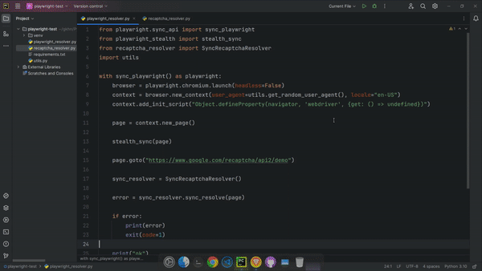

## reCAPTCHA Resolver (Python-Playwright)
This project is an auxiliary tool that enables the automatic solving of reCAPTCHA using Python and Playwright.


## Preview



## Installation
- All the required dependencies are defined in the "requirements.txt" file.
- All you need to do is navigate to the location where the "requirements.txt" file is located and execute the following command.

```
pip3 install -r requirements.txt
```

## Usage
Using reCAPTCHA Resolver is very straightforward.

```python
from recaptcha_resolver import SyncRecaptchaResolver

sync_resolver = SyncRecaptchaResolver()
error = sync_resolver.sync_resolve(page)

if error:
    print(error)
    exit(code=1)

```

- Import the "SyncRecaptchaResolver" class.
- Create a new instance.
- Call the "sync_resolve" function of the "SyncRecaptchaResolver" class and provide a Playwright Page as a parameter.
- It will resolve the Google reCAPTCHA on the provided "page."
- If an error occurs, it will return an "error"; otherwise, the error will be "None."

## Example

An example of solving the reCAPTCHA at the "https://www.google.com/recaptcha/api2/demo" address.

```python
from playwright.sync_api import sync_playwright
from playwright_stealth import stealth_sync
from recaptcha_resolver import SyncRecaptchaResolver
import utils

with sync_playwright() as playwright:
    browser = playwright.chromium.launch(headless=False)
    context = browser.new_context(user_agent=utils.get_random_user_agent(), locale="en-US")
    context.add_init_script("Object.defineProperty(navigator, 'webdriver', {get: () => undefined})")

    page = context.new_page()

    stealth_sync(page)

    page.goto("https://www.google.com/recaptcha/api2/demo")

    sync_resolver = SyncRecaptchaResolver()
    error = sync_resolver.sync_resolve(page)

    if error:
        print(error)
        exit(code=1)

    print("ok")
    page.wait_for_timeout(timeout=1000)
    page.locator("#recaptcha-demo-submit").click()
    page.wait_for_timeout(timeout=3000)


```


